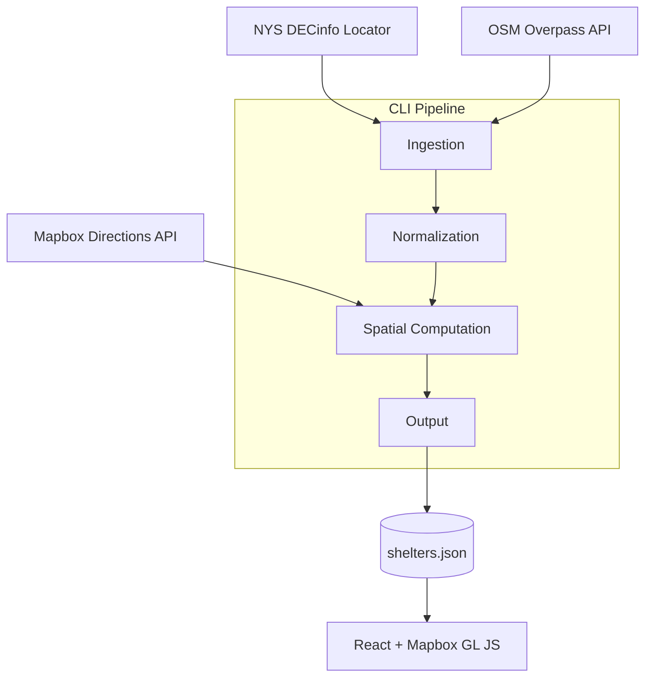

# ADK Lean-To Explorer

An interactive map of lean-to shelters and primitive campsites in the Adirondack Park. Each shelter is tagged with precomputed spatial metrics — trail distance to the nearest parking lot, distance to the nearest water source, and distance to the nearest neighboring shelter. Clicking any shelter draws these relationships live on the map.


---

## How it works

A TypeScript CLI pipeline ingests public GIS data from the NYS DECinfo Locator (ArcGIS) and OSM Overpass API, computes spatial metrics for every shelter, and writes a single static `shelters.json` file. The React frontend loads that file directly — no backend server.



Each shelter is precomputed with distance to the nearest parking lot (trail-routed — straight-line is misleading in the backcountry), nearest water source, and nearest neighboring shelter. Clicking a shelter draws all three relationships live on the map alongside a detail panel with distances and feature names.

---

## Data sources

All data is public.

| Data                | Source                                                                 |
| ------------------- | ---------------------------------------------------------------------- |
| Lean-to locations   | NYS DECinfo Locator — `dil_land_assets_lean_to`                        |
| Primitive campsites | NYS DECinfo Locator — `dec_backcountry_features`                       |
| Trailhead parking   | NYS DECinfo Locator — `dec_backcountry_features` (public parking lots) |
| Water features      | NYS DECinfo Locator — GNIS layer, filtered to NY water types           |
| Park boundary       | NYS DECinfo Locator — Blue Line polygon                                |
| Trail routing       | Mapbox Directions API (`mapbox/walking` profile)                       |

---

## Tech stack

**Pipeline** — TypeScript, Node.js, Turf.js, flatbush (R-tree spatial index), Mapbox Directions API

**Frontend** — React, Vite, TypeScript, Mapbox GL JS (react-map-gl)

**Deployment** — Static hosting (no backend)

---

## Running locally

### Prerequisites

- Node.js 18+
- A [Mapbox access token](https://account.mapbox.com/)

### Pipeline

```bash
cd pipeline
npm install
```

Set `MAPBOX_TOKEN` in your environment, then:

```bash
npm start
```

This writes `shelters.json` to `pipeline/output/`. Copy it to `frontend/public/shelters.json` before running the frontend.

### Frontend

```bash
cd frontend
npm install
```

Create `frontend/.env.local`:

```
VITE_MAPBOX_TOKEN=your_token_here
```

```bash
npm run dev
```

---

## Project structure

```
pipeline/        CLI tool — ingestion, normalization, spatial computation, JSON output
frontend/        React app — map, spatial visualization, filtering
specs/           Project spec and per-phase spec documents
```

The pipeline and frontend are independent projects. `shelters.json` is the only contract between them.

